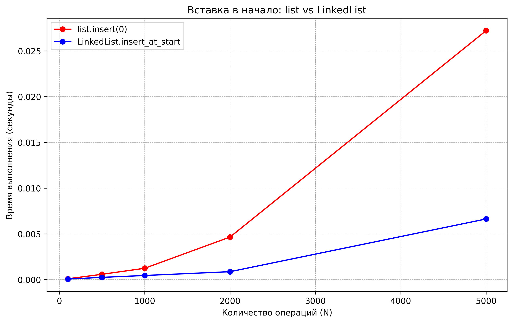
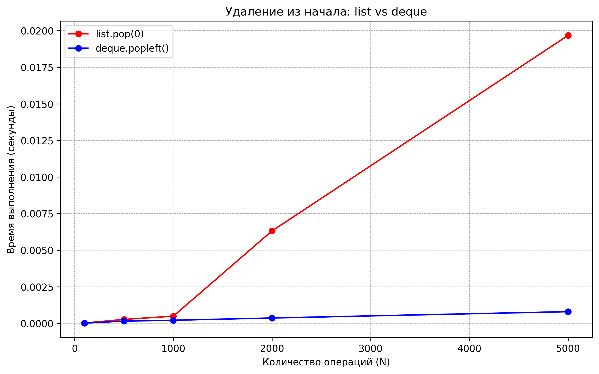

# Отчет по лабораторной работе 02
## Основные структуры данных. Анализ и применение

**Дата:** 2025-11-15  
**Семестр:** 3 курс 2 полугодие - 6 семестр  
**Группа:** ПИЖ-б-о-23-2  
**Дисциплина:** Анализ сложности алгоритмов  
**Студент:** Силина Оксана Романовна

### Цель работы
Изучить понятие и особенности базовых абстрактных типов данных (стек, очередь, дек, связный список) и их реализаций в Python. Научиться выбирать оптимальную структуру данных для решения конкретной задачи, основываясь на анализе теоретической и практической сложности операций. Получить навыки измерения производительности и применения структур данных для решения практических задач.

### Теоретическая часть

**Список (list)** — Реализация динамического массива.
- Обеспечивает амортизированное время O(1) для добавления в конец (append)
- Вставка и удаление в середину имеют сложность O(n) из-за сдвига элементов
- Доступ по индексу — O(1)

**Связный список (Linked List)** — Абстрактная структура данных, состоящая из узлов
- Вставка и удаление в известное место (например, начало списка) выполняются за O(1)
- Доступ по индексу и поиск — O(n)

**Стек (Stack)** — Абстрактный тип данных, работающий по принципу LIFO (Last-In-First-Out)
- Основные операции: push (добавление, O(1)), pop (удаление с вершины, O(1)), peek (просмотр вершины, O(1))
- В Python может быть реализован на основе списка (list)

**Очередь (Queue)** — Абстрактный тип данных, работающий по принципу FIFO (First-In-First-Out)
- Основные операции: enqueue (добавление в конец, O(1)), dequeue (удаление из начала, O(1))
- В Python для эффективной реализации используется collections.deque

**Дек (Deque)** — Двусторонняя очередь, позволяющая добавлять и удалять элементы как в начало, так и в конец
- Все основные операции — O(1)
- В Python реализован в классе collections.deque

### Практическая часть

#### Реализованные методы

**linked_list.py**
- `insert_at_start(data)` — O(1)
- `insert_at_end(data)` — O(1) с поддержкой tail
- `delete_from_start()` — O(1)
- `traversal()` — O(n)
- `size()` — O(n)

**task_solutions.py**
- `is_balanced_brackets()` — O(n) - проверка сбалансированности скобок с использованием стека
- `is_palindrome_deque()` — O(n) - проверка палиндрома с использованием дека
- `print_queue_simulation()` — O(n) - симуляция обработки задач в очереди печати

#### Характеристики ПК для тестирования
- **Процессор:** Amd Ryzen 3 Pro 3200G 3.6/4GHz
- **Оперативная память:** 16 GB DDR4
- **ОС:** Windows 10
- **Python:** 3.13

## Графики производительности

### 1. Сравнение вставки в начало

**Анализ:**
- `LinkedList.insert_at_start` — O(1) (постоянное время)
- `list.insert(0)` — O(n) (линейный рост)

### 2. Сравнение операций очереди

**Анализ:**
- `deque.popleft()` — O(1) (эффективная реализация)
- `list.pop(0)` — O(n) (требует сдвига элементов)

#### Результаты решения практических задач

**1. Проверка сбалансированности скобок**
- Использован стек на основе list
- Успешно протестированы различные комбинации скобок
- Все тестовые случаи обработаны корректно

**2. Проверка палиндромов**
- Использован deque для эффективной проверки с двух концов
- Протестированы строки на русском и английском языках
- Числовые последовательности также корректно обработаны

**3. Симуляция очереди печати**
- Реализована на основе deque
- Наглядно продемонстрирован принцип FIFO
- Все задачи обработаны в порядке поступления

### Общие выводы

1. **Экспериментальное подтверждение асимптотической сложности:**
   - `LinkedList.insert_at_start` и `deque.popleft()` — O(1)
   - `list.insert(0)` и `list.pop(0)` — O(n)

2. **Рекомендации по выбору структур данных:**
   - Для операций в начале структуры данных предпочтительнее использовать LinkedList или deque
   - Python-список эффективен как динамический массив для доступа по индексу и добавления в конец
   - Для частых операций в начале/конце следует использовать deque

3. **Практическая значимость:**
   - Реализованные алгоритмы демонстрируют эффективное применение структур данных
   - Выбор оптимальной структуры данных существенно влияет на производительность

### Контрольные вопросы

**1. В чем ключевое отличие динамического массива (list в Python) от связного списка с точки зрения сложности операций вставки в начало и доступа по индексу?**

**Динамический массив (list в Python):**

*Структура:* 
- Элементы хранятся в непрерывном блоке памяти
- При создании резервируется определенная емкость (capacity)
- При заполнении выделяется новый больший блок и данные копируются

*Доступ по индексу (например, list[i]):*
- **Сложность: O(1)**
- Адрес элемента вычисляется по формуле: `адрес_начала + индекс × размер_элемента`
- Прямое обращение к памяти без последовательного прохода

*Вставка в начало (например, list.insert(0, element)):*
- **Сложность: O(n)**
- Требуется сдвиг ВСЕХ существующих элементов на одну позицию вправо
- В худшем случае: копирование n элементов
- Возможное перераспределение памяти при нехватке емкости

**Связный список:**

*Структура:*
- Состоит из узлов (nodes), разбросанных в памяти
- Каждый узел содержит: данные + указатель на следующий узел
- В двусвязном списке: также указатель на предыдущий узел

*Доступ по индексу (например, получить i-й элемент):*
- **Сложность: O(n)**
- Необходимо последовательно пройти от головы списка через i узлов
- В худшем случае: проход через все n элементов

*Вставка в начало:*
- **Сложность: O(1)**
- Создается новый узел
- Указатель нового узла устанавливается на старую голову
- Голова списка обновляется на новый узел
- Только 3 операции с указателями, независимо от размера списка

**2. Объясните принцип работы стека (LIFO) и очереди (FIFO). Приведите по два примера их практического использования.**

**Стек (LIFO - Last In First Out):**
- Принцип: последний добавленный элемент извлекается первым
- Основные операции: push (добавление), pop (извлечение)
- Примеры использования:
  - Система вызовов функций и возвратов в программировании (call stack)
  - История браузера (кнопка "Назад")

**Очередь (FIFO - First In First Out):**
- Принцип: первый добавленный элемент извлекается первым
- Основные операции: enqueue (добавление), dequeue (извлечение)
- Примеры использования:
  - Очередь задач в операционной системе
  - Обработка запросов к веб-серверу

**3. Почему операция удаления первого элемента из списка (list) в Python имеет сложность O(n), а из дека (deque) — O(1)?**

**list (динамический массив):**
- Удаление первого элемента требует сдвига всех последующих элементов на одну позицию влево
- Каждый элемент должен быть перемещен, что дает линейную сложность O(n)

**deque (двусторонняя очередь):**
- Реализован на основе двусвязного списка или кольцевого буфера
- Удаление из начала требует только обновления указателей
- Не зависит от количества элементов - константная сложность O(1)

**4. Какую структуру данных вы бы выбрали для реализации системы отмены действий (undo) в текстовом редакторе? Обоснуйте свой выбор.**

**Рекомендуемая структура:** Стек (или два стека для undo/redo)

**Обоснование выбора:**
- Естественное соответствие принципу LIFO - последнее действие отменяется первым
- Эффективная сложность операций добавления и удаления (O(1))
- Простота реализации и понимания
- Минимальные требования к памяти

**Альтернативный вариант:** Можно использовать двусвязный список для возможности навигации по истории, но стек более оптимален для базовой функциональности undo.

**5. Замеры показали, что вставка 1000 элементов в начало списка заняла значительно больше времени, чем вставка в начало вашей реализации связного списка. Объясните результаты с точки зрения асимптотической сложности.**

**Анализ результатов:**

**Для динамического массива (list):**
- Каждая вставка в начало: O(n)
- Общая сложность для 1000 вставок: O(1000 × n) ≈ O(n²) в худшем случае
- Требуется многократное перераспределение памяти и копирование данных

**Для связного списка:**
- Каждая вставка в начало: O(1)
- Общая сложность для 1000 вставок: O(1000) ≈ O(1)
- Только создание узлов и обновление указателей

**Вывод:** Разница в производительности объясняется фундаментальным различием в структурах данных. Связный список предпочтительнее для операций вставки/удаления в начале, тогда как динамический массив лучше подходит для задач с частым случайным доступом.