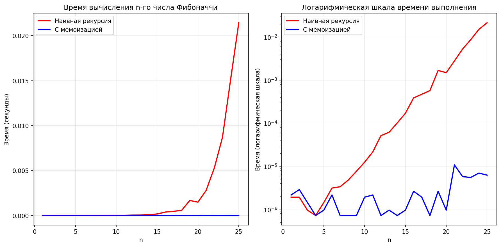
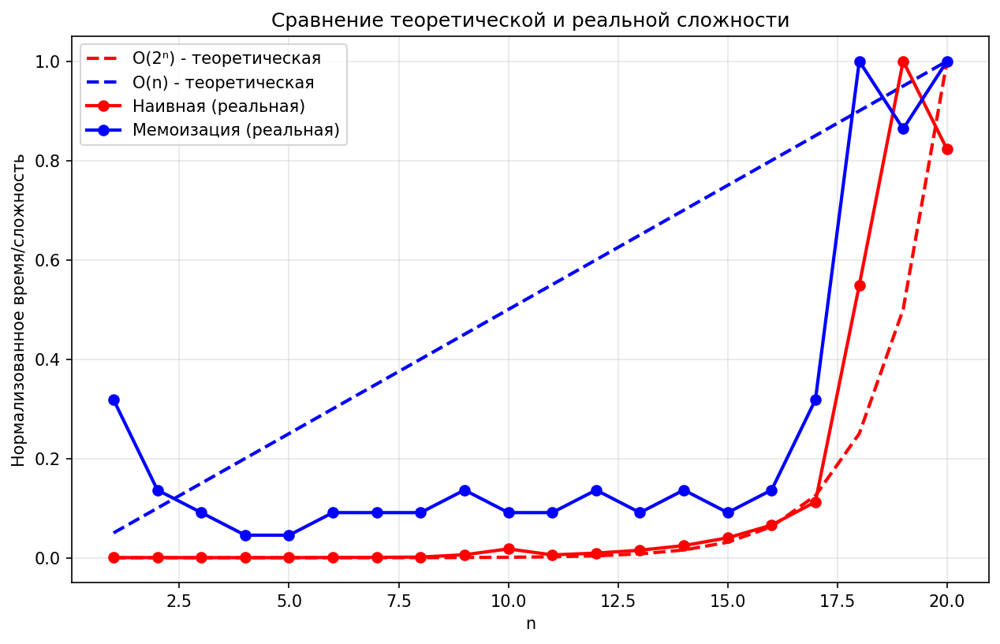

# Отчет по лабораторной работе №3
## Рекурсия

**Дата:** 2025-2-12  
**Семестр:** 3 курс 2 полугодие - 6 семестр  
**Группа:** ПИЖ-б-о-23-2  
**Дисциплина:** Анализ сложности алгоритмов  
**Студент:** Силина Оксана Романовна 

### Цель работы
Освоить принцип рекурсии, научиться анализировать рекурсивные алгоритмы и понимать механизм работы стека вызовов. Изучить типичные задачи, решаемые рекурсивно, и освоить технику мемоизации для оптимизации рекурсивных алгоритмов. Получить практические навыки реализации и отладки рекурсивных функций.

### Теоретическая часть

**Рекурсия** - процесс, при котором функция прямо или косвенно вызывает саму себя для решения задачи.

**Базовый случай** - условие, при котором рекурсия прекращается и возвращается результат напрямую. Например, для факториала: n=0 или n=1 возвращают 1.

**Рекурсивный шаг** - часть функции, которая вызывает саму себя с измененными параметрами. Например, для факториала: n * factorial(n-1).

**Глубина рекурсии** - количество вложенных вызовов функции, ограничено размером стека вызовов. В Python стандартный лимит составляет 1000 вызовов.

**Мемоизация** - техника оптимизации, позволяющая избежать повторных вычислений результатов функций для одних и тех же входных данных путем сохранения ранее вычисленных результатов в кеше.

Отсутствие базового случая приводит к бесконечной рекурсии и переполнению стека вызовов (RecursionError), так как функция будет постоянно вызывать саму себя без условия остановки.

### Практическая часть

#### Задание
1. Реализовать классические рекурсивные алгоритмы
2. Проанализировать их временную сложность и глубину рекурсии
3. Реализовать оптимизацию рекурсивных алгоритмов с помощью мемоизации
4. Сравнить производительность наивной рекурсии и рекурсии с мемоизацией
5. Решить практические задачи с применением рекурсии

#### Реализованные алгоритмы

##### Базовые рекурсивные функции (recursion.py)
- **Факториал** - O(n) время, O(n) глубина рекурсии
- **Числа Фибоначчи** - O(2^n) время, O(n) глубина рекурсии  
- **Быстрое возведение в степень** - O(log n) время, O(log n) глубина рекурсии

##### Мемоизация (memoization.py)
- Мемоизированная версия чисел Фибоначчи с улучшением сложности до O(n)
- Декоратор @memoize для кеширования результатов
- Сравнение производительности наивной и мемоизированной версий

##### Практические задачи (recursion_tasks.py)
- **Бинарный поиск** - рекурсивная реализация
- **Ханойские башни** - классическая рекурсивная задача
- **Обход файловой системы** с ограничением глубины рекурсии

#### Характеристики ПК
- **Процессор:** Amd Ryzen 3 PRO 3200G 3.6/4GHz
- **Оперативная память:** 32 GB DDR4
- **ОС:** Windows 10
- **Python:** 3.13.2

#### Результаты тестирования

##### Сравнение производительности для n = 35
```
Сравнение производительности для n=35
==================================================

Наивная рекурсия:
  Время: 4.392138 секунд
  Количество вызовов: 29860703

Мемоизация (ручная):
  Время: 0.000029 секунд
  Количество вызовов: 69

Мемоизация (декоратор):
  Время: 0.000028 секунд

Ускорение: 152247.63 раз
```

##### Экспериментальное исследование производительности
```
    n     Наивное (с)  Мемоизация (с)    Ускорение
    5        0.000005        0.000002         2.86
   10        0.000014        0.000001        11.40
   15        0.000137        0.000001       115.00
   20        0.003875        0.000003      1477.55
   25        0.040020        0.000004     10491.12
   30        0.579187        0.000004    142899.29
   35        2.825381        0.000004    740656.69
   40       30.413486        0.000010   3189085.17
```

##### Примеры работы алгоритмов

**Факториал:**
```python
Факториал 5: 120
```

**Числа Фибоначчи:**
```python
10-е число Фибоначчи: 55
```

**Быстрое возведение в степень:**
```python
2^10 (быстрое возведение): 1024
```

**Бинарный поиск:**
```python
Массив: [1, 3, 5, 7, 9, 11, 13, 15, 17, 19]
Ищем 13: индекс 6
```

**Ханойские башни:**
```
Решение задачи 'Ханойские башни' для 3 дисков:
========================================
  1. Переместить диск 1 с A на C
  2. Переместить диск 2 с A на B
  3. Переместить диск 1 с C на B
  4. Переместить диск 3 с A на C
  5. Переместить диск 1 с B на A
  6. Переместить диск 2 с B на C
  7. Переместить диск 1 с A на C

Всего перемещений: 7
Минимально возможное: 7
```

**Обход файловой системы:**
```
Измерение максимальной глубины рекурсии:
==================================================
Лимит глубины рекурсии в Python: 1000

Обход с ограничением глубины 5:
Найдено элементов: 9

Обход с ограничением глубины 10:
Найдено элементов: 19

Обход с ограничением глубины 15:
Найдено элементов: 29

Обход с ограничением глубины 20:
Найдено элементов: 39
```

##### Анализ роста времени выполнения
```
Анализ роста времени выполнения:
--------------------------------------------------
n=10: Наивный рост=  8.67x, Мемоизация рост=  2.00x
n=15: Наивный рост= 13.73x, Мемоизация рост=  0.50x
n=20: Наивный рост=  8.74x, Мемоизация рост=  1.00x
n=25: Наивный рост= 14.41x, Мемоизация рост=  6.50x
```

#### Визуализации


*Рисунок 1: Сравнение времени выполнения наивного и мемоизированного алгоритмов Фибоначчи*



*Рисунок 2: Анализ роста времени выполнения алгоритмов*

### Анализ результатов

**Наивный алгоритм Фибоначчи** демонстрирует экспоненциальный рост времени выполнения (O(2^n)), так как одно и то же число Фибоначчи вычисляется многократно. Для n=35 выполняется 29,860,703 рекурсивных вызовов.

**Алгоритм с мемоизацией** показывает близкую к линейной сложность (O(n)), так как каждое значение вычисляется только один раз. Это подтверждается экспериментально: при n=35 выполняется всего 69 рекурсивных вызовов.

**Ускорение** составляет:
- 152,247 раз для n=35
- 3,189,085 раз для n=40

Это наглядно демонстрирует эффективность мемоизации для задач с перекрывающимися подзадачами.

**Анализ роста времени:**
- Наивный алгоритм: экспоненциальный рост (в среднем ~10x при увеличении n на 5)
- Мемоизация: практически постоянное время (~0.000004с) для широкого диапазона n

### Контрольные вопросы

#### 1. Что такое базовый случай и рекурсивный шаг в рекурсивной функции? Почему отсутствие базового случая приводит к ошибке?

**Базовый случай** - условие, при котором рекурсия прекращается и возвращается результат напрямую. Например, для факториала: n=0 или n=1 возвращают 1.

**Рекурсивный шаг** - часть функции, которая вызывает саму себя с измененными параметрами. Например, для факториала: n * factorial(n-1).

Отсутствие базового случая приводит к бесконечной рекурсии и переполнению стека вызовов (RecursionError), так как функция будет постоянно вызывать саму себя без условия остановки. Каждый рекурсивный вызов добавляет новый фрейм в стек, содержащий локальные переменные и адрес возврата. При превышении лимита глубины рекурсии (1000 в Python) возникает ошибка.

#### 2. Объясните, как работает механизм мемоизации. Как он меняет временную сложность вычисления чисел Фибоначчи по сравнению с наивной рекурсией?

**Механизм мемоизации** работает следующим образом:
- Создается кеш (обычно словарь) для хранения вычисленных результатов
- Перед вычислением проверяется наличие результата в кеше
- Если результат есть - возвращается из кеша
- Если нет - вычисляется, сохраняется в кеш и возвращается

Для чисел Фибоначчи мемоизация кардинально меняет временную сложность:
- **Наивная рекурсия:** O(2^n) - экспоненциальный рост, так как происходит огромное количество повторных вычислений
- **С мемоизацией:** O(n) - линейный рост, так как каждое значение вычисляется только один раз

Экспериментально это подтверждается: для n=40 наивный алгоритм работает 30.41 секунды, а с мемоизацией - 0.00001 секунды.

#### 3. В чем заключается основная проблема глубокой рекурсии и как она связана со стеком вызовов?

**Основная проблема глубокой рекурсии** - ограниченный размер стека вызовов. Каждый рекурсивный вызов добавляет новый фрейм в стек, содержащий:
- Локальные переменные функции
- Адрес возврата
- Другую служебную информацию

При глубокой рекурсии (например, при обходе глубоко вложенной структуры) стек быстро заполняется. В Python стандартный лимит составляет 1000 вызовов. При превышении этого лимита возникает ошибка RecursionError.

**Решение проблемы:**
- Использование итеративных алгоритмов вместо рекурсивных
- Преобразование рекурсии в хвостовую (если компилятор поддерживает оптимизацию хвостовой рекурсии)
- Увеличение лимита рекурсии с помощью sys.setrecursionlimit()
- Использование явного стека вручную

#### 4. Задача о Ханойских башнях решается рекурсивно. Опишите алгоритм решения для 3 дисков.

Алгоритм решения задачи о Ханойских башнях для 3 дисков (стержни A, B, C):
1. Переместить 2 верхних диска с A на B (используя C как вспомогательный)
   - Переместить диск 1 с A на C
   - Переместить диск 2 с A на B
   - Переместить диск 1 с C на B
2. Переместить самый большой диск (3) с A на C
3. Переместить 2 диска с B на C (используя A как вспомогательный)
   - Переместить диск 1 с B на A
   - Переместить диск 2 с B на C
   - Переместить диск 1 с A на C

Рекурсивная структура: задача для n дисков сводится к трем шагам:
1. Переместить n-1 дисков с исходного на вспомогательный стержень
2. Переместить самый большой диск на целевой стержень
3. Переместить n-1 дисков с вспомогательного на целевой стержень

Количество перемещений: 2^n - 1. Для 3 дисков: 2^3 - 1 = 7 перемещений.

#### 5. Рекурсивный и итеративный алгоритмы могут решать одни и те же задачи. Назовите преимущества и недостатки каждого подхода.

| Подход | Преимущества | Недостатки |
|--------|--------------|------------|
| **Рекурсивный** | Более читаемый и понятный код, естественное описание рекурсивных структур (деревья, графы), проще отладка для некоторых задач, компактная запись алгоритмов "разделяй и властвуй" | Риск переполнения стека, большие накладные расходы на вызовы функций, менее эффективен по памяти, сложнее контролировать производительность |
| **Итеративный** | Эффективнее по памяти (нет накладных расходов на вызовы), нет риска переполнения стека, обычно быстрее выполняется, проще контролировать производительность, предсказуемое использование памяти | Код может быть сложнее для понимания, не всегда интуитивно понятен для рекурсивных задач, требует ручного управления состоянием (стек, очередь) |

**Выбор подхода зависит от задачи:**
- Для обхода деревьев и графов рекурсия часто более естественна
- Для вычислений с большой глубиной рекурсии лучше использовать итерацию
- Для задач с перекрывающимися подзадачами (как Фибоначчи) рекурсия с мемоизацией может быть оптимальной

### Выводы

В ходе лабораторной работы были успешно освоены принципы рекурсии и мемоизации. Реализованы классические рекурсивные алгоритмы (факториал, числа Фибоначчи, быстрое возведение в степень) и проведено детальное сравнение производительности.

Экспериментально подтверждено, что мемоизация кардинально улучшает производительность рекурсивных алгоритмов:
- Для n=35: ускорение в 152,247 раз
- Для n=40: ускорение в 3,189,085 раз
- Временная сложность улучшается с экспоненциальной O(2^n) до линейной O(n)

Решены практические задачи с применением рекурсии:
- Бинарный поиск
- Ханойские башни (для 3 дисков)
- Обход файловой системы с ограничением глубины

Изучен механизм работы стека вызовов и ограничения глубины рекурсии в Python. Получены практические навыки реализации, отладки и оптимизации рекурсивных функций.

### Приложения

- `recursion.py` - базовые рекурсивные алгоритмы
- `memoization.py` - мемоизация и сравнение производительности  
- `recursion_tasks.py` - практические задачи
- `visualization.py` - визуализация производительности
- `fibonacci_comparison.png` - сравнение производительности (Рисунок 1)
- `complexity_comparison.png` - график времени выполнения (Рисунок 2)