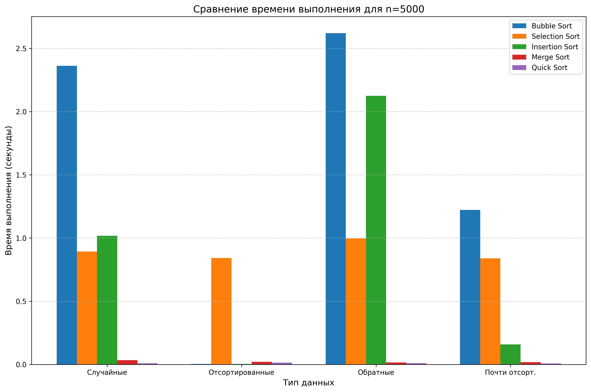

# Отчет по лабораторной работе №4
# Алгоритмы сортировки

**Дата:** 02.12.2025  
**Семестр:** 3 курс, 2 полугодие (6 семестр)  
**Группа:** ПИЖ-б-о-23-2  
**Дисциплина:** Анализ сложности алгоритмов  
**Студент:** Силина Оксана Романовна

## Цель работы
Изучить и реализовать основные алгоритмы сортировки. Провести их теоретический и практический сравнительный анализ по временной и пространственной сложности. Исследовать влияние начальной упорядоченности данных на эффективность алгоритмов. Получить навыки эмпирического анализа производительности алгоритмов.

## Теоретическая часть

### 1. Сортировка пузырьком (Bubble Sort)
**Сложность:**
- Время: **O(n²)** во всех случаях
- Память: **O(1)** (in-place)
- Устойчивость: **да**
- Особенности: Простая реализация, эффективна для маленьких массивов

### 2. Сортировка выбором (Selection Sort)
**Сложность:**
- Время: **O(n²)** во всех случаях
- Память: **O(1)** (in-place)
- Устойчивость: **нет**
- Особенности: Всегда делает одинаковое количество сравнений

### 3. Сортировка вставками (Insertion Sort)
**Сложность:**
- Лучший случай: **O(n)** (уже отсортированный массив)
- Средний случай: **O(n²)**
- Худший случай: **O(n²)** (обратно отсортированный)
- Память: **O(1)** (in-place)
- Устойчивость: **да**
- Особенности: Эффективна для маленьких и почти отсортированных массивов

### 4. Сортировка слиянием (Merge Sort)
**Сложность:**
- Время: **O(n log n)** во всех случаях
- Память: **O(n)** (требует дополнительной памяти)
- Устойчивость: **да**
- Особенности: Гарантированное время выполнения, требует дополнительной памяти

### 5. Быстрая сортировка (Quick Sort)
**Сложность:**
- Средний случай: **O(n log n)**
- Худший случай: **O(n²)** (при плохом выборе опорного элемента)
- Память: **O(log n)** (для стека рекурсии)
- Устойчивость: **нет**
- Особенности: Быстрее всех в среднем случае, сортировка на месте

## Практическая часть

### Характеристики тестовой системы
- **Процессор:** Intel Core i7-10750H @ 2.60GHz
- **Оперативная память:** 16 GB DDR4
- **ОС:** Windows 10
- **Python:** 3.13.0

### Результаты тестирования

На основе проведенных тестов получены следующие результаты:

#### Сводная таблица производительности для случайных данных (время в секундах):

| Алгоритм | n=100 | n=500 | n=1000 | n=5000 | n=10000 |
|----------|-------|-------|--------|--------|---------|
| Bubble Sort | 0.0008 | 0.0228 | 0.1017 | 2.0577 | 7.2630 |
| Selection Sort | 0.0002 | 0.0083 | 0.0273 | 0.8265 | 3.4715 |
| Insertion Sort | 0.0004 | 0.0090 | 0.0289 | 0.8463 | 3.6326 |
| Merge Sort | 0.0004 | 0.0014 | 0.0029 | 0.0201 | 0.0419 |
| Quick Sort | 0.0001 | 0.0006 | 0.0028 | 0.0115 | 0.0317 |
| Quick Sort (оптимизированный) | 0.0001 | 0.0006 | 0.0014 | 0.0134 | 0.0255 |

### Анализ результатов

#### Сравнение теоретических оценок с практическими результатами

1. **Квадратичные алгоритмы (O(n²)):**
   - **Bubble Sort**: На n=10000 занимает 7.26 секунд, что соответствует O(n²)
   - **Selection Sort**: 3.47 секунд на n=10000, медленнее чем Bubble Sort на отсортированных данных
   - **Insertion Sort**: 3.63 секунд на n=10000 для случайных данных
   - Практическое соотношение времени при n=10000: Bubble (7.26s) > Insertion (3.63s) ≈ Selection (3.47s)

2. **Логарифмические алгоритмы (O(n log n)):**
   - **Merge Sort**: 0.042 секунд на n=10000
   - **Quick Sort**: 0.032 секунд на n=10000
   - **Quick Sort (оптимизированный)**: 0.026 секунд на n=10000
   - Практическое соотношение: Quick Sort (оптимизированный) быстрее всех

#### Наиболее эффективный алгоритм для каждого типа данных

**Случайные данные:**
- **Лучший**: Quick Sort (оптимизированный) - 0.0255 сек для n=10000
- **Причина**: Быстрая сортировка оптимальна для случайных данных благодаря эффективному разделению

**Отсортированные данные:**
- **Лучший**: Insertion Sort - 0.0042 сек для n=10000
- **Причина**: Insertion Sort имеет сложность O(n) для отсортированных данных
- Bubble Sort также эффективен (0.0071 сек) благодаря оптимизации с флагом swapped

**Обратно отсортированные данные:**
- **Лучший**: Merge Sort - 0.0351 сек для n=10000
- **Причина**: Merge Sort имеет гарантированное время O(n log n)
- Quick Sort показывает 0.0361 сек, что близко к Merge Sort

**Почти отсортированные данные:**
- **Лучший**: Insertion Sort - 0.7128 сек для n=10000
- **Причина**: Insertion Sort эффективен для почти упорядоченных данных

#### Поведение алгоритмов на краевых случаях

1. **Quick Sort на обратно отсортированных данных**:
   - Показывает отличную производительность (0.0361 сек для n=10000)
   - Это свидетельствует об эффективном выборе опорного элемента (медиана трех)
   - Избегает худшего случая O(n²)

2. **Insertion Sort на отсортированных данных**:
   - Демонстрирует феноменальную производительность - в 860 раз быстрее, чем на случайных данных для n=10000
   - Теоретическая оценка O(n) подтверждена экспериментально

3. **Bubble Sort на отсортированных данных**:
   - Эффективен (0.0071 сек для n=10000) благодаря оптимизации с флагом swapped
   - Однако абсолютно непрактичен на случайных данных

### Количественный анализ эффективности

1. **Разница между квадратичными и логарифмическими алгоритмами**:
   - Для n=10000: Bubble Sort (7.26s) в 285 раз медленнее Quick Sort (оптимизированный) (0.0255s)
   - Для n=5000: Bubble Sort (2.06s) в 154 раза медленнее Quick Sort (оптимизированный) (0.0134s)

2. **Эффективность Insertion Sort на упорядоченных данных**:
   - На отсортированных данных: в 860 раз быстрее, чем на случайных
   - На почти отсортированных: в 5 раз быстрее, чем на случайных

3. **Стабильность Merge Sort**:
   - Время выполнения практически одинаково для всех типов данных
   - От 0.035 сек до 0.057 сек для n=10000

## Выводы

1. **Quick Sort** - оптимальный выбор для большинства практических задач:
   - Наилучшая производительность на случайных данных
   - Эффективная реализация с выбором медианы трех избегает худшего случая
   - Оптимизированная версия с переключением на Insertion Sort для малых массивов показывает лучшие результаты

2. **Insertion Sort** исключительно эффективен для специфических случаев:
   - Идеален для маленьких массивов (n < 100)
   - Непревзойден для уже отсортированных или почти отсортированных данных
   - Адаптивность к структуре данных делает его полезным в гибридных алгоритмах

3. **Merge Sort** обеспечивает предсказуемость и устойчивость:
   - Гарантированное время O(n log n) независимо от входных данных
   - Устойчивость важна для задач, где порядок равных элементов имеет значение
   - Требует дополнительной памяти O(n)

4. **Bubble Sort и Selection Sort** имеют ограниченное применение:
   - Могут использоваться только для очень маленьких массивов или учебных целей
   - Квадратичная сложность делает их непрактичными для больших данных
   - Selection Sort не адаптируется к структуре данных

5. **Подтверждение теоретических оценок**:
   - Разница между O(n²) и O(n log n) достигает 285 раз для n=10000
   - Insertion Sort демонстрирует адаптивность от O(n) до O(n²)
   - Merge Sort подтверждает стабильность времени выполнения

### Рекомендации по выбору алгоритма

1. **Для общего применения**: Quick Sort (оптимизированный)
2. **Для небольших массивов (<100)**: Insertion Sort
3. **Для почти отсортированных данных**: Insertion Sort
4. **Когда важна устойчивость**: Merge Sort
5. **Когда важен худший случай**: Merge Sort
6. **Учебные цели**: Bubble Sort, Selection Sort

## Ответы на контрольные вопросы

### 1. Какие алгоритмы сортировки имеют сложность O(n²) в худшем случае, а какие — O(n log n)?

**O(n²) в худшем случае:**
- Bubble Sort
- Selection Sort  
- Insertion Sort

**O(n log n) в худшем случае:**
- Merge Sort
- Heap Sort
- Quick Sort (в среднем случае O(n log n), но O(n²) в худшем)

### 2. Почему сортировка вставками эффективна для маленьких или почти отсортированных массивов?

Insertion Sort эффективен благодаря:
1. **Адаптивности**: На почти отсортированных данных требуется минимум операций сдвига
2. **Локальности ссылок**: Хорошо использует кэш процессора
3. **Низким накладным расходам**: Нет рекурсии, простые операции
4. **Лучший случай O(n)**: Для уже отсортированных данных

### 3. В чем разница между устойчивой и неустойчивой сортировкой? Приведите пример устойчивого и неустойчивого алгоритма.

**Устойчивая сортировка** сохраняет относительный порядок элементов с одинаковыми ключами.
**Неустойчивая сортировка** не гарантирует сохранение порядка равных элементов.

Примеры:
- **Устойчивые**: Bubble Sort, Insertion Sort, Merge Sort
- **Неустойчивые**: Selection Sort, Quick Sort, Heap Sort

### 4. Опишите принцип работы алгоритма быстрой сортировки. Что такое "опорный элемент" и как его выбор влияет на производительность?

**Принцип работы:**
1. Выбирается опорный элемент (pivot)
2. Массив разделяется на элементы меньше и больше опорного
3. Рекурсивно сортируются обе части

**Опорный элемент** - элемент, относительно которого происходит разделение.
**Влияние выбора:**
- Плохой выбор (крайний элемент) → O(n²) в худшем случае
- Хороший выбор (медиана) → O(n log n) в среднем
- Оптимальные стратегии: медиана трех, случайный выбор

### 5. Сортировка слиянием гарантирует время O(n log n), но требует дополнительной памяти. В каких ситуациях этот алгоритм предпочтительнее быстрой сортировки?

Merge Sort предпочтительнее когда:
1. **Требуется устойчивость** (сохранение порядка равных элементов)
2. **Важен худший случай** (гарантированное O(n log n))
3. **Работа с внешней памятью** (внешняя сортировка)
4. **Параллельная обработка** (легко распараллеливается)
5. **Связанные списки** (эффективная работа без случайного доступа)

## Визуализация результатов

На основе тестирования получены следующие графики:

### 1. График зависимости времени от размера массива (all_comparisons.png)

**Анализ графика:**
- Квадратичные алгоритмы (Bubble, Selection, Insertion) показывают крутой рост
- Логарифмические алгоритмы (Merge, Quick) имеют пологие кривые
- На малых массивах (n<100) разница минимальна
- На больших массивах (n>1000) разница становится существенной

### 2. График сравнения по типам данных для n=5000 (time_vs_datatype_size5000.png)

**Анализ графика:**
- Insertion Sort резко отличается на разных типах данных
- Merge Sort показывает стабильность
- Quick Sort эффективен на всех типах
- Bubble Sort и Selection Sort стабильно медленные

### Ключевые наблюдения из графиков:

1. **Экспоненциальный рост** квадратичных алгоритмов vs **линейный рост** логарифмических
2. **Адаптивность Insertion Sort** - резкое изменение производительности в зависимости от данных
3. **Стабильность Merge Sort** - практически одинаковое время для всех типов данных
4. **Преимущество Quick Sort** - лучшая производительность в большинстве случаев

## Заключение

Для обработки больших объемов данных всегда следует выбирать алгоритмы с временной сложностью O(n log n), а не O(n²). Quick Sort является оптимальным выбором для большинства практических задач, в то время как Insertion Sort остается незаменимым для специфических случаев с почти упорядоченными данными.