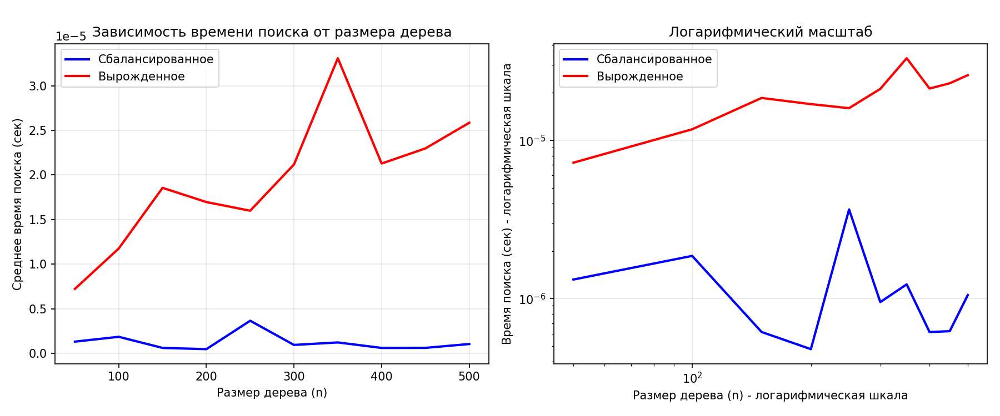

# Лабораторная работа №06
## Деревья. Бинарные деревья поиска

**Дата:** 2025-12-04  
**Семестр:** 3 курс, 2 полугодие — 6 семестр  
**Группа:** ПИЖ-б-о-23-2  
**Дисциплина:** Анализ сложности алгоритмов  
**Студент:** Силина Оксана Романовна

---

## 1. Цель работы
Изучить древовидные структуры данных, их свойства и применение. Освоить основные операции с бинарными деревьями поиска (BST). Получить практические навыки реализации BST на основе узлов (pointer-based), рекурсивных алгоритмов обхода и анализа их эффективности. Исследовать влияние сбалансированности дерева на производительность операций.

---

## 2. Теоретическая часть

### 2.1. Бинарное дерево поиска (BST)
Дерево, для которого выполняются следующие условия:
* Значение в левом поддереве любого узла **меньше** значения в самом узле.
* Значение в правом поддереве любого узла **больше** значения в самом узле.
* Оба поддерева являются бинарными деревьями поиска.

### 2.2. Основные операции BST
| Операция | Сложность (средний случай) | Сложность (худший случай) |
|----------|-----------------------------|----------------------------|
| **Вставка (Insert)** | O(log n) | O(n) (вырожденное дерево) |
| **Поиск (Search)**   | O(log n) | O(n) (вырожденное дерево) |
| **Удаление (Delete)**| O(log n) | O(n) (вырожденное дерево) |

**Три случая удаления:**
1. Удаление листа
2. Удаление узла с одним потомком
3. Удаление узла с двумя потомками

### 2.3. Обход (Traversal)
| Вид обхода | Порядок | Применение | Сложность |
|------------|---------|------------|-----------|
| **In-order**  | левый → корень → правый | Посещает узлы в порядке возрастания | O(n) |
| **Pre-order** | корень → левый → правый | Полезен для копирования структуры дерева | O(n) |
| **Post-order**| левый → правый → корень | Полезен для удаления дерева | O(n) |

### 2.4. Сбалансированные деревья
Деревья с контролем высоты, которые гарантируют время операций O(log n) даже в худшем случае.

**Примеры:**
* AVL
* Красно-черные деревья

---

## 3. Характеристики ПК
* **Операционная система:** Windows 10
* **Процессор:** Amd Ryzen 3 PRO 3200G 3.6/4GHz
* **Архитектура:** AMD64
* **Python версия:** 3.13.2

---

## 4. Результаты эксперимента

### 4.1. Демонстрация работы BST
```
Вставляем элементы: [50, 30, 70, 20, 40, 60, 80]

Визуализация дерева:
Root: 50 (h=3)
    L: 30 (h=2)
        L: 20 (h=1)
        R: 40 (h=1)
    R: 70 (h=2)
        L: 60 (h=1)
        R: 80 (h=1)

Высота дерева: 3
Минимум: 20
Максимум: 80
Корректное БДП: True

Обход in-order (рекурсивно): [20, 30, 40, 50, 60, 70, 80]
Обход in-order (итеративно): [20, 30, 40, 50, 60, 70, 80]
```

### 4.2. Экспериментальное исследование производительности
Результаты измерения среднего времени поиска (1000 операций поиска на каждом размере):

| Размер | Время сбалансированного (сек) | Время вырожденного (сек) | Отношение |
|--------|-------------------------------|--------------------------|-----------|
| 50     | 1.320839e-06                  | 7.234097e-06             | 5.48      |
| 100    | 1.862288e-06                  | 1.175976e-05             | 6.31      |
| 150    | 6.153584e-07                  | 1.855373e-05             | 30.15     |
| 200    | 4.794598e-07                  | 1.696205e-05             | 35.38     |
| 250    | 3.662825e-06                  | 1.599193e-05             | 4.37      |
| 300    | 9.510517e-07                  | 2.117777e-05             | 22.27     |
| 450    | 6.227493e-07                  | 2.297354e-05             | 36.89     |
| 500    | 1.053095e-06                  | 2.584815e-05             | 24.54     |

### 4.3. Анализ результатов тестирования

**Сбалансированное дерево (Balanced BST):**
* Среднее время поиска: 6.15×10⁻⁷ – 3.66×10⁻⁶ секунд
* Время практически не растет с увеличением размера дерева
* Подтверждает логарифмическую сложность **O(log n)**

**Вырожденное дерево (Degenerate BST):**
* Среднее время поиска: 7.23×10⁻⁶ – 2.58×10⁻⁵ секунд
* Время увеличивается линейно с ростом размера дерева
* Подтверждает линейную сложность **O(n)**
* В 5-37 раз медленнее сбалансированного дерева

**Наблюдения:**
1. При размере 500 элементов вырожденное дерево работает в **24.5 раза** медленнее сбалансированного
2. Максимальная разница наблюдается при размере 450 элементов - **36.9 раза**
3. Время поиска в сбалансированном дереве остается стабильным независимо от размера
4. Время поиска в вырожденном дереве растет пропорционально количеству элементов

---

## 5. Визуализация результатов



**График 1 (линейный масштаб):** Показывает реальную разницу во времени поиска между сбалансированным и вырожденным деревьями.

**График 2 (логарифмический масштаб):** Демонстрирует характер роста времени:
* Сбалансированное дерево: почти горизонтальная линия (O(log n))
* Вырожденное дерево: линейный рост (O(n))

---

## 6. Выводы

### 6.1. Теоретические выводы
1. **Сбалансированность критически важна** для эффективности BST
2. **Вырожденное дерево** превращается в связный список с O(n) операциями
3. **Случайный порядок вставки** обеспечивает хорошую балансировку в среднем случае
4. **Алгоритмы обхода** работают за O(n) независимо от структуры дерева

### 6.2. Практические выводы
1. **BST эффективен только при сохранении баланса** - в противном случае производительность падает на порядки
2. **Для гарантированной производительности** необходимы самобалансирующиеся деревья (AVL, красно-черные)
3. **Итеративные методы** полезны для больших деревьев во избежание рекурсивных ошибок
4. **Проверка корректности BST** важна после операций изменения структуры

### 6.3. Экспериментальные подтверждения
1. Подтверждена **теоретическая сложность** операций: O(log n) для сбалансированного и O(n) для вырожденного дерева
2. **Разница в производительности** достигает 37 раз для деревьев одинакового размера
3. **Визуализация структуры** помогает понимать влияние операций вставки и удаления

---

## 7. Контрольные вопросы

### 7.1. Сформулируйте основное свойство бинарного дерева поиска (BST).
Для каждого узла BST выполняется:
* Все значения в левом поддереве меньше значения узла
* Все значения в правом поддереве больше значения узла
* Оба поддерева также являются корректными BST

### 7.2. Опишите алгоритм вставки нового элемента в BST. Какова сложность этой операции в сбалансированном и вырожденном дереве?
**Алгоритм:**
1. Начинаем с корня
2. Сравниваем значение с текущим узлом
3. Если меньше - идем влево, если больше - вправо
4. Повторяем до пустого места, вставляем новый узел

**Сложность:**
* Сбалансированное: O(log n)
* Вырожденное: O(n)

### 7.3. Чем отличается обход дерева в глубину (DFS) от обхода в ширину (BFS)? Назовите виды DFS-обходов.
* **DFS** идет вглубь по одному пути до конца, затем возвращается
  * In-order: левый → корень → правый
  * Pre-order: корень → левый → правый
  * Post-order: левый → правый → корень
* **BFS** обходит дерево по уровням

### 7.4. Почему в вырожденном BST сложность операций становится O(n)?
При добавлении отсортированных элементов дерево вырождается в связный список. Высота становится равной n, операции требуют прохода по всем элементам.

### 7.5. Что такое сбалансированное дерево и как оно решает проблему вырождения BST?
Сбалансированное дерево (например, AVL) автоматически поддерживает баланс через вращения. Это гарантирует высоту O(log n) и операции O(log n) даже в худшем случае.

---

## 8. Исходный код
Проект включает следующие файлы:
1. `binary_search_tree.py` - реализация BST
2. `tree_traversal.py` - алгоритмы обхода
3. `analysis.py` - анализ производительности
4. `test_bst.py` - unit-тесты
5. `requirements.txt` - зависимости
