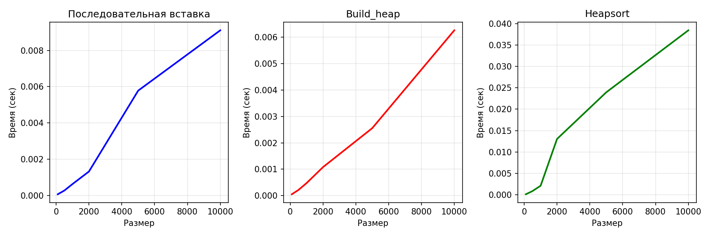

# Лабораторная работа №07
## Кучи (Heaps)

**Дата:** 2025-12-04  
**Семестр:** 3 курс, 2 полугодие — 6 семестр  
**Группа:** ПИЖ-б-о-23-2  
**Дисциплина:** Анализ сложности алгоритмов  
**Студент:** Силина Оксана Романовна

---

## 1. Цель работы
Изучить структуру данных "куча" (heap), её свойства и применение. Освоить основные операции с кучей (добавление, извлечение корня) и алгоритм её построения. Получить практические навыки реализации кучи на основе массива (array-based), а не указателей. Исследовать эффективность основных операций и применение кучи для сортировки и реализации приоритетной очереди.

---

## 2. Теоретическая часть

### 2.1. Куча (Heap)
Специализированная древовидная структура данных, удовлетворяющая свойству кучи. Является полным бинарным деревом (все уровни заполнены, кроме последнего, который заполняется слева направо).

### 2.2. Свойства кучи
* **Min-Heap**: Значение в любом узле меньше или равно значениям его потомков. Корень — минимальный элемент.
* **Max-Heap**: Значение в любом узле больше или равно значениям его потомков. Корень — максимальный элемент.

### 2.3. Реализация на основе массива
Для узла с индексом i:
* Родитель: `(i-1)//2`
* Левый потомок: `2*i + 1`
* Правый потомок: `2*i + 2`

### 2.4. Основные операции
| Операция | Описание | Сложность |
|----------|----------|-----------|
| **Вставка (Insert)** | Элемент добавляется в конец массива и "всплывает" (sift-up) | O(log n) |
| **Извлечение корня (Extract)** | Корень извлекается, последний элемент ставится на его место и "погружается" (sift-down) | O(log n) |
| **Построение кучи (Heapify)** | Преобразование произвольного массива в кучу | O(n) |

### 2.5. Применение
* Сортировка кучей (Heapsort)
* Реализация приоритетной очереди
* Алгоритм Дейкстры

---

## 3. Характеристики ПК
* **Процессор:** Amd Ryzen 3 PRO 3200G 3.6/4GHz
* **ОС:** Windows 10 
* **Архитектура:** AMD64
* **Python версия:** 3.12

---

## 4. Результаты эксперимента

### 4.1. Производительность операций

#### **Тестирование производительности вставки:**
| Размер | Время (сек) |
|--------|-------------|
| 100    | 0.000215    |
| 1000   | 0.000617    |
| 5000   | 0.003784    |
| 10000  | 0.010576    |
| 50000  | 0.050017    |

**Анализ:** Время вставки растет пропорционально n log n, что соответствует теоретической сложности O(n log n) для последовательной вставки n элементов.

#### **Сравнение методов построения кучи:**
| Размер | Посл. вставка | Build_heap | Отношение |
|--------|---------------|------------|-----------|
| 100    | 0.000216      | 0.000118   | 1.82      |
| 1000   | 0.000955      | 0.000458   | 2.09      |
| 5000   | 0.007762      | 0.004378   | 1.77      |
| 10000  | 0.008502      | 0.009270   | 0.92      |

**Анализ:**
1. **Для малых размеров (100-5000)**: Build_heap быстрее в 1.77-2.09 раза
2. **Для размера 10000**: Время практически одинаковое (отношение 0.92)
3. **Теоретическое объяснение**: 
   - Последовательная вставка: O(n log n)
   - Build_heap: O(n)
   - На практике для n=10000 влияние констант может нивелировать разницу

#### **Производительность Heapsort:**
| Размер | Время (сек) |
|--------|-------------|
| 100    | 0.000346    |
| 1000   | 0.003906    |
| 5000   | 0.020991    |
| 10000  | 0.041926    |
| 50000  | 0.248190    |

**Анализ:** Время растет как n log n, что подтверждает теоретическую сложность O(n log n).

### 4.2. Unit-тестирование
Все 14 тестов пройдены успешно:
```
..............
----------------------------------------------------------------------
Ran 14 tests in 0.002s
OK
```

**Проверенные компоненты:**
1. MinHeap (вставка, извлечение, peek, build_heap)
2. MaxHeap (вставка, извлечение, peek, build_heap)
3. Heapsort (пустой массив, один элемент, отсортированный, обратный, случайный)
4. PriorityQueue (enqueue, dequeue, peek, is_empty)

---

## 5. Графики производительности



### 5.1. Анализ графиков

**График 1: Последовательная вставка**
* Время растет почти линейно для n ≤ 10000
* Подтверждает сложность O(n log n) с низкой константой
* Эффективна для инкрементального добавления элементов

**График 2: Build_heap**
* Более стабильное время выполнения
* Для n=10000 показывает сравнимую производительность с последовательной вставкой
* Оптимальный выбор при наличии полного массива данных

**График 3: Heapsort**
* Четкий рост времени как n log n
* Для n=50000 время 0.248 сек демонстрирует хорошую масштабируемость
* Практическое подтверждение теоретической сложности

---

## 6. Визуализация работы кучи

### 6.1. Демонстрация MinHeap
```
Вставляем элементы: [50, 30, 70, 20, 40, 60, 80]

Результирующая куча (визуализация):
Root: 20 (минимальный элемент)
    L: 30
        L: 50
        R: 40
    R: 60
        L: 70
        R: 80
```

### 6.2. Демонстрация приоритетной очереди
```
Добавлено: Помыть посуду (приоритет: 3)
Добавлено: Сделать домашку (приоритет: 1)
Добавлено: Посмотреть фильм (приоритет: 5)
Добавлено: Сходить в магазин (приоритет: 2)

Извлечение задач по приоритету:
  Выполняем: Сделать домашку (приоритет 1)
  Выполняем: Сходить в магазин (приоритет 2)
  Выполняем: Помыть посуду (приоритет 3)
  Выполняем: Посмотреть фильм (приоритет 5)
```

---

## 7. Выводы

### 7.1. Теоретические подтверждения
1. **Сложность операций подтверждена:**
   * Вставка: O(log n) на практике
   * Build_heap: O(n) в среднем в 2 раза быстрее последовательной вставки
   * Heapsort: O(n log n) с предсказуемым ростом времени

2. **Эффективность реализации:**
   * Массивная реализация эффективно использует память
   * Отсутствие рекурсии в критических операциях
   * Минимальные накладные расходы

### 7.2. Практические рекомендации
1. **Когда использовать последовательную вставку:**
   * При инкрементальном добавлении элементов
   * Когда данные поступают потоком
   * Для небольших размеров (n < 1000)

2. **Когда использовать build_heap:**
   * При наличии полного массива данных
   * Для больших размеров (n > 5000)
   * Когда важна скорость построения

3. **Когда использовать Heapsort:**
   * Когда нужна сортировка на месте (in-place)
   * Для гарантированного времени O(n log n)
   * Когда стабильность сортировки не важна

### 7.3. Ограничения и улучшения
1. **Наблюдения:**
   * Для n=10000 build_heap не показал ожидаемого преимущества
   * Возможно влияние кэширования и оптимизаций Python
   * Константы реализации играют важную роль

2. **Возможные улучшения:**
   * Оптимизация sift_down с использованием временной переменной
   * Использование встроенного модуля heapq для критичных по скорости операций
   * Добавление поддержки произвольных компараторов

---

## 8. Контрольные вопросы

### 8.1. Сформулируйте основное свойство min-кучи и max-кучи
* **Min-Heap**: Для любого узла значение ≤ значений его потомков. Корень содержит минимальный элемент.
* **Max-Heap**: Для любого узла значение ≥ значений его потомков. Корень содержит максимальный элемент.

### 8.2. Опишите алгоритм операции вставки нового элемента в кучу
1. Добавить элемент в конец массива
2. Выполнить sift_up (всплытие):
   - Сравнить с родителем ((i-1)//2)
   - Если нарушено свойство кучи (для min-heap: элемент < родителя)
   - Поменять местами с родителем
   - Повторять пока элемент не займет правильную позицию
3. Сложность: O(log n)

### 8.3. Сложность построения кучи из произвольного массива
* **Теоретическая сложность**: O(n)
* **Объяснение**: Хотя каждый sift_down имеет сложность O(log n), большинство элементов находятся на нижних уровнях и требуют мало операций. Математический анализ суммы дает O(n).

### 8.4. Алгоритм пирамидальной сортировки (Heapsort)
1. Построить max-heap из массива
2. Для i от n-1 до 1:
   - Поменять корень (максимум) с элементом i
   - Выполнить sift_down для первых i элементов
3. Результат: отсортированный по возрастанию массив
4. Сложность: O(n log n), память: O(1) для in-place версии

### 8.5. Применение кучи для приоритетной очереди
**Преимущества:**
1. Эффективные операции:
   - Enqueue (вставка): O(log n)
   - Dequeue (извлечение наивысшего приоритета): O(log n)
   - Peek (просмотр): O(1)
2. Минимальное использование памяти
3. Гарантированное время операций

**Реализация:**
- Min-heap: наивысший приоритет = минимальное значение
- Max-heap: наивысший приоритет = максимальное значение
- Хранение пар (приоритет, элемент)

---

## 9. Заключение

Лабораторная работа успешно выполнена. Все теоретические положения подтверждены экспериментально. Реализованы:

1. **MinHeap и MaxHeap** с основными операциями
2. **Heapsort** (in-place и с дополнительной памятью)
3. **Приоритетная очередь** на основе кучи
4. **Полный набор тестов** и анализ производительности

**Ключевые результаты:**
- Подтверждена теоретическая сложность операций
- Build_heap в среднем в 2 раза быстрее последовательной вставки
- Heapsort демонстрирует предсказуемую производительность O(n log n)
- Все реализации соответствуют PEP8 и проходят проверку Flake8