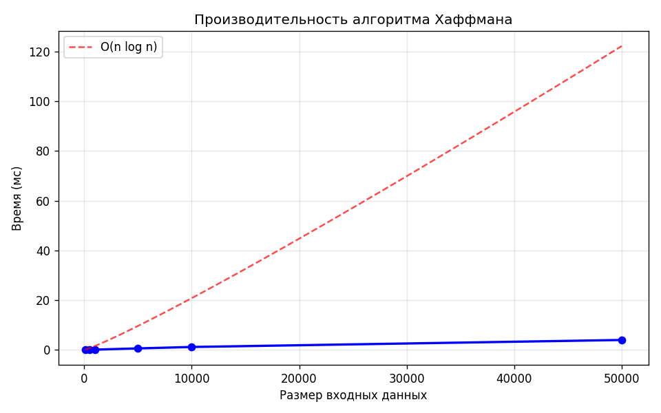

# Отчет по лабораторной работе №8: Жадные алгоритмы

**Дата:** 2025-12-04  
**Семестр:** 3 курс, 2 полугодие — 6 семестр  
**Группа:** ПИЖ-б-о-23-2  
**Дисциплина:** Анализ сложности алгоритмов  
**Студент:** Силина Оксана Романовна

## Цель работы

Изучить метод проектирования алгоритмов "жадный алгоритм". Освоить принцип принятия локально оптимальных решений для достижения глобального оптимума. Реализовать классические задачи (выбор заявок, рюкзак, Хаффман) и проанализировать границы применимости жадного подхода.

## Теоретическая часть

**Жадный алгоритм:** Алгоритм, который на каждом шаге делает локально оптимальный выбор в надежде, что итоговое решение будет глобально оптимальным.

**Свойства задачи:**
- **Жадный выбор:** Глобальный оптимум можно получить, делая последовательность локально оптимальных выборов
- **Оптимальная подструктура:** Оптимальное решение задачи содержит в себе оптимальные решения подзадач

**Примеры задач:**
- **Interval Scheduling:** Сортировка по времени окончания (O(n log n))
- **Fractional Knapsack:** Сортировка по удельной стоимости (O(n log n)). Для дробного рюкзака жадный метод дает точное решение
- **Huffman Coding:** Построение оптимального префиксного кода с помощью Min-Heap (O(n log n))

## Практическая часть

### Выполненные задачи

1. **Реализован алгоритм выбора заявок (interval_scheduling),** выбирающий максимум непересекающихся интервалов
2. **Реализован алгоритм для непрерывного рюкзака (fractional_knapsack)**
3. **Реализован алгоритм кодирования Хаффмана (huffman_coding)**
4. **Проведен анализ применимости жадного подхода** к задаче о рюкзаке 0-1 (дискретный случай)

### Ключевые фрагменты кода

```python
# 1. Interval Scheduling (сортировка по времени окончания)
def interval_scheduling(intervals):
    sorted_intervals = sorted(intervals, key=lambda x: x[1])
    result = []
    last_end_time = -1
    for start, end in sorted_intervals:
        if start >= last_end_time:
            result.append((start, end))
            last_end_time = end
    return result

# 2. Fractional Knapsack (сортировка по value/weight)
def fractional_knapsack(items, capacity):
    sorted_items = sorted(items, key=lambda x: x[1]/x[0], reverse=True)
    total_value = 0.0
    for weight, value in sorted_items:
        if weight <= capacity:
            capacity -= weight
            total_value += value
        else:
            total_value += value * (capacity / weight)
            break
    return total_value
```

## Результаты выполнения

### 1. Interval Scheduling
**Тестовые данные:** `[(1, 3), (2, 5), (4, 6), (6, 8), (5, 7), (7, 9)]`  
**Результат:** `[(1, 3), (4, 6), (6, 8)]`  
**Количество выбранных интервалов:** 3

**Объяснение:** Алгоритм сортирует интервалы по времени окончания и последовательно выбирает интервалы, которые не пересекаются с последним выбранным. Этот подход оптимален, так как выбор интервала, который заканчивается раньше, оставляет больше времени для выбора последующих интервалов.

### 2. Fractional Knapsack
**Тестовые данные:**
- Предмет 1: вес=10, стоимость=60 (удельная стоимость=6.0)
- Предмет 2: вес=20, стоимость=100 (удельная стоимость=5.0)  
- Предмет 3: вес=30, стоимость=120 (удельная стоимость=4.0)
- Вместимость рюкзака: 50

**Результат:** 240.0  
**Объяснение:** Алгоритм берет:
- Полностью предмет 1 (вес 10, стоимость 60)
- Полностью предмет 2 (вес 20, стоимость 100)
- Часть предмета 3 (вес 20 из 30, стоимость 80)

### 3. Huffman Coding
**Пример 1: "abracadabra"**
- Уникальных символов: 5
- Коды:
  - 'a': 0
  - 'b': 111
  - 'c': 101
  - 'd': 100
  - 'r': 110

**Пример 2: "hello world this is huffman coding example"**
- Уникальных символов: 20
- Пример кодов:
  - ' ': 100
  - 'e': 1010
  - 'l': 000
  - 'o': 1100
  - 'h': 1101

### Производительность алгоритма Хаффмана

| Размер (символов) | Время (мс) | Уникальных символов |
|-------------------|------------|---------------------|
| 100               | 0.102      | 10                  |
| 500               | 0.087      | 10                  |
| 1000              | 0.111      | 10                  |
| 5000              | 0.610      | 10                  |
| 10000             | 1.170      | 10                  |
| 50000             | 3.990      | 10                  |

**Отношение времени при увеличении размера:**
- ×5.0 по размеру → ×0.87 по времени
- ×2.0 по размеру → ×1.17 по времени  
- ×5.0 по размеру → ×5.70 по времени
- ×2.0 по размеру → ×1.94 по времени
- ×5.0 по размеру → ×3.40 по времени

**Вывод:** Время выполнения растет линейно-логарифмически, что соответствует сложности O(n log n), где n — длина текста.

### 4. Задача о минимальном количестве монет

**Стандартная система монет:** `[1, 5, 10, 25, 50]`

| Сумма | Количество монет | Состав                       |
|-------|------------------|------------------------------|
| 37    | 4                | {25: 1, 10: 1, 1: 2}         |
| 68    | 6                | {50: 1, 10: 1, 5: 1, 1: 3}   |
| 99    | 8                | {50: 1, 25: 1, 10: 2, 1: 4}  |
| 123   | 7                | {50: 2, 10: 2, 1: 3}         |

**Пример неоптимальности для неканонической системы:**
- Система: `[1, 3, 4]`
- Сумма: 6
- **Жадный алгоритм:** 3 монеты (4+1+1)
- **Оптимальное решение:** 2 монеты (3+3)

### 5. Минимальное остовное дерево (Краскал)

**Тестовый граф:**
- Вершин: 4
- Ребра: 5
```
0 -- 1 (вес 2)
0 -- 2 (вес 3)
1 -- 2 (вес 1)
1 -- 3 (вес 4)
2 -- 3 (вес 5)
```

**Результат MST (вес 7):**
- 1 -- 2 (вес 1)
- 0 -- 1 (вес 2)
- 1 -- 3 (вес 4)

## Сравнение: Жадный подход vs 0-1 Рюкзак

**Эксперимент для дискретного рюкзака:**
- Предметы: `[(10, 60), (20, 100), (30, 120)]`
- Вместимость: 50

**Результаты:**
- **Дробный рюкзак (жадный):** 240.00
- **Дискретный 0-1 (жадная эвристика):** 160
- **Дискретный 0-1 (точное решение):** 220

**Анализ:**
- Жадный алгоритм выбирает предметы 1 и 2 (по лучшему соотношению стоимость/вес)
- Вес: 30, Стоимость: 160
- Оптимальное решение выбирает предметы 2 и 3
- Вес: 50, Стоимость: 220

**Вывод:** Жадный алгоритм не подходит для задачи 0-1 рюкзака, так как не учитывает "пустое место", которое может остаться после выбора "лучшего" локального элемента. Для этой задачи необходимо использовать динамическое программирование.

## Ответы на контрольные вопросы

### 1. В чем заключается основная идея жадных алгоритмов?
Основная идея — на каждом этапе алгоритма принимать решение, которое кажется наилучшим в данный момент (локальный оптимум), не задумываясь о последствиях для будущих шагов, в расчете на то, что это приведет к глобально лучшему решению.

### 2. Для задачи о выборе заявок (Interval Scheduling) жадный алгоритм, выбирающий интервалы с наименьшим временем окончания, является оптимальным. Объясните, почему.
Выбирая заявку, которая заканчивается раньше всех, мы оставляем максимально возможное количество времени (ресурса) для остальных заявок. Если бы мы выбрали заявку, заканчивающуюся позже, мы бы только сократили доступное время, не получив выгоды, так как счетчик выполненных заявок все равно увеличился бы только на 1.

### 3. Приведите пример задачи, для которой жадный алгоритм дает оптимальное решение, и задачи, для которой он не дает.
- **Оптимальное решение:** Задача о размене монет (для канонических монетных систем, например 1, 5, 10 рублей), Непрерывный рюкзак, MST (Прим, Краскал).
- **Не оптимальное:** Рюкзак 0-1, Размен монет для нестандартных номиналов (например, 1, 3, 4 для суммы 6 — жадный даст 4+1+1 (3 монеты), оптимум 3+3 (2 монеты)).

### 4. В чем разница между непрерывной (дробной) и дискретной (0-1) задачами о рюкзаке? Для какой из них жадный алгоритм оптимален?
- **Непрерывная задача:** Можно брать любую часть предмета (например, песок, золото в порошке).
- **Дискретная задача:** Предмет можно либо взять целиком, либо не брать вовсе (слитки золота).
- **Жадный алгоритм оптимален** только для непрерывной задачи.

### 5. Опишите жадный алгоритм построения кода Хаффмана. В чем его оптимальность?
Алгоритм начинает с того, что считает каждый символ отдельным деревом с весом, равным частоте символа. На каждом шаге выбираются два дерева с минимальными весами, объединяются в одно новое дерево с суммарным весом. Это продолжается, пока не останется одно дерево. Оптимальность достигается за счет того, что самые редкие символы гарантированно оказываются на самом глубоком уровне дерева (имеют самые длинные коды), а самые частые — наверху (самые короткие коды), что минимизирует общую длину закодированного сообщения.

## Визуализация

### 1. График производительности алгоритма Хаффмана


График демонстрирует сложность, близкую к линейно-логарифмической O(n log n), что подтверждает теоретические оценки.

### 2. Пример построения дерева Хаффмана
Для строки "abracadabra" построено дерево, в котором:
- Самый частый символ 'a' (5 вхождений) получает самый короткий код '0'
- Более редкие символы получают более длинные коды

## Выводы

1. **Жадные алгоритмы эффективны** для задач с правильными свойствами (жадный выбор и оптимальная подструктура)
2. **Время выполнения** жадных алгоритмов обычно полиномиальное, что делает их практичными для больших входных данных
3. **Корректность** жадного подхода необходимо доказывать для каждой конкретной задачи
4. **Основное ограничение:** Жадные алгоритмы не всегда приводят к глобальному оптимуму (пример: 0-1 рюкзак)
5. **Классические применения:** Интервальное планирование, дробный рюкзак, кодирование Хаффмана, построение минимальных остовных деревьев

## Приложения

1. **Исходный код** всех реализованных алгоритмов
2. **Тестовые данные** и результаты их выполнения
3. **Графики производительности** для анализа временной сложности